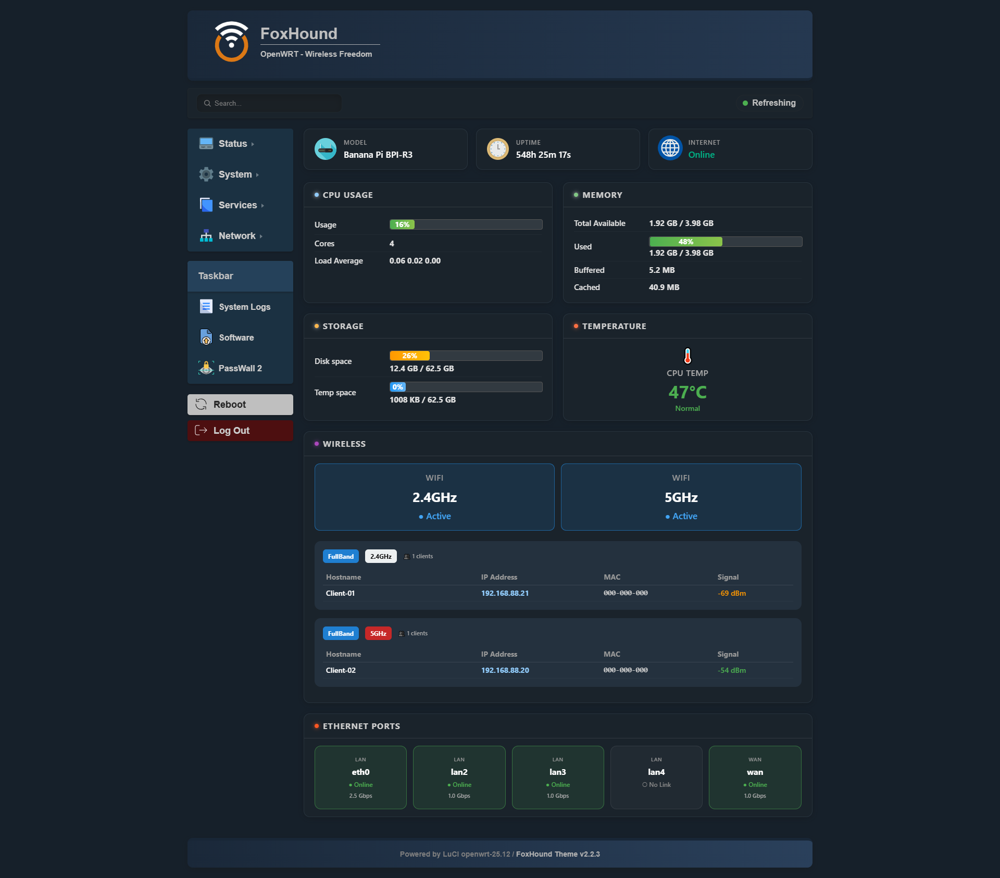
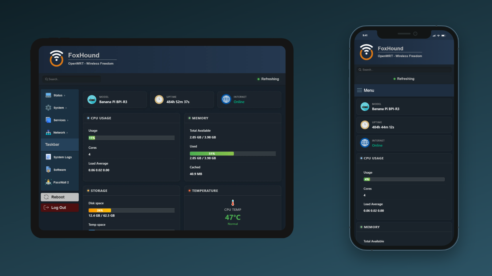

# OpenWrt LuCI Theme : FoxHound

**an advanced and modern theme for OpenWrt LuCI**

[](LICENSE)
[](https://openwrt.org)

[Live Demo](https://fullband7.github.io/openwrt-theme-foxhound/demo) · [Installation](#-installation) · [Customization](#-customization) · [Contributing](#-contributing)

<br>



<br>

FoxHound rebuilds the default LuCI Bootstrap look from the ground up. You get a live dashboard, a polished dark and light interface, and a layout that feels right on phones and tablets, all while keeping LuCI as familiar as ever.

> **Try it first :** the [live demo](https://fullband7.github.io/openwrt-theme-foxhound/demo) runs the full interface in your browser.

## ✨ Highlights

| | |
|---|---|
| 📊 **Live dashboard** | Real-time widgets for CPU, memory, storage, temperature, Wi-Fi clients, Ethernet ports, VPN status, uptime and internet connectivity at a glance. |
| 🧩 **Your dashboard, your way** | Turn widgets on or off and drag them into the order you like. |
| 🎨 **Color palettes** | Dark and light palettes included. Drop in your own palette file and it shows up in the settings automatically. |
| 🖼️ **Personal branding** | Set your own logo, wallpaper and login page look right from the settings page. |
| 🔍 **Quick search** | Find any LuCI setting from the search bar at the top of every page. |
| 📱 **Fully responsive** | Touch-friendly controls, reflowed tables and a collapsible sidebar. Tested down to 320px on iOS and Android. |
| 🔌 **PassWall2 ready** | PassWall2 pages are detected and styled to match, with no broken layouts. |
| 🔄 **Update notifications** | the theme tells you when a new release is available and shows the release notes inside LuCI. |
| 🚀 **Fast and light** | A rewritten stylesheet built on modern CSS, with smooth and lightweight animations. |

## 📱 Fully Responsive



<br>

Every page is adapted to phones, tablets and desktops, so managing your router from your pocket feels as comfortable as doing it from a monitor.

- **Adapts to every screen size.** Multiple breakpoints cover everything from wide desktop displays down to 320px phones. The dashboard grid reflows from several columns into a clean single column.
- **Collapsible navigation.** On small screens the sidebar becomes a slide-in menu that opens from a Menu button and closes with a tap outside it.
- **Built for touch.** Larger buttons, form fields and dropdowns are easy to tap accurately.
- **PassWall2 included.** Its pages, including the node list and ACL, have dedicated mobile layouts, so nothing breaks or scrolls sideways.
- **Tested on iOS and Android.** Checked on a range of screen sizes, down to 320px.

## 📋 Compatibility

| OpenWrt | Package manager |
|---------|-----------------|
| 25.12   | `apk`           |
| 24.10   | `opkg`          | 

FoxHound is built for personal use and may look slightly different on some devices. If you spot a color or layout issue, please [open an issue](https://github.com/fullband7/openwrt-theme-foxhound/issues) and include your router model and OpenWrt version.

## 📥 Installation

Connect to your router over SSH, make sure it has internet access, and run :

```sh
wget -qO- https://raw.githubusercontent.com/fullband7/openwrt-theme-foxhound/main/installer.sh | sh
```

The installer does everything for you :

- Detects your OpenWrt version and picks the right package (`.apk` or `.ipk`)
- Downloads and installs the latest release
- Activates FoxHound as your LuCI theme

When it finishes, reload LuCI in your browser (`Ctrl + F5`) and log in. If the old theme still shows, reboot the router once.

## 🎨 Customization

Open **System → Theme Settings** in LuCI to :

- Choose a color palette
- Change the subtitle text under your router name
- Upload a logo and wallpaper for the dashboard and for the login page
- Enable, disable and reorder dashboard widgets

Logos support PNG, JPG, GIF and WEBP. Wallpapers support JPG. The maximum upload size is 2 MB.

### Create your own palette

Every color, radius and shadow in FoxHound is a CSS custom property, so a palette is just one small CSS file.

1. Copy `dark.css` or `light.css` from the palette folder on your router :

   ```
   /www/luci-static/foxhound/resources/css/palette/
   ```

2. Rename the copy, for example `ocean.css`, and edit the colors you want to change.
3. Open **Theme Settings**. Your palette appears in the color palette list, ready to select.

Palette file names can use letters, numbers, `-` and `_` only.

## 🤝 Contributing

Contributions are welcome.

1. Fork the repository and create a feature branch.
2. Keep style changes inside the existing CSS variable system.
3. Test on a real OpenWrt device or VM before opening a pull request.
4. Update the documentation if you add new components.

Help with device-specific compatibility (MediaTek, Qualcomm and others) is especially appreciated.
